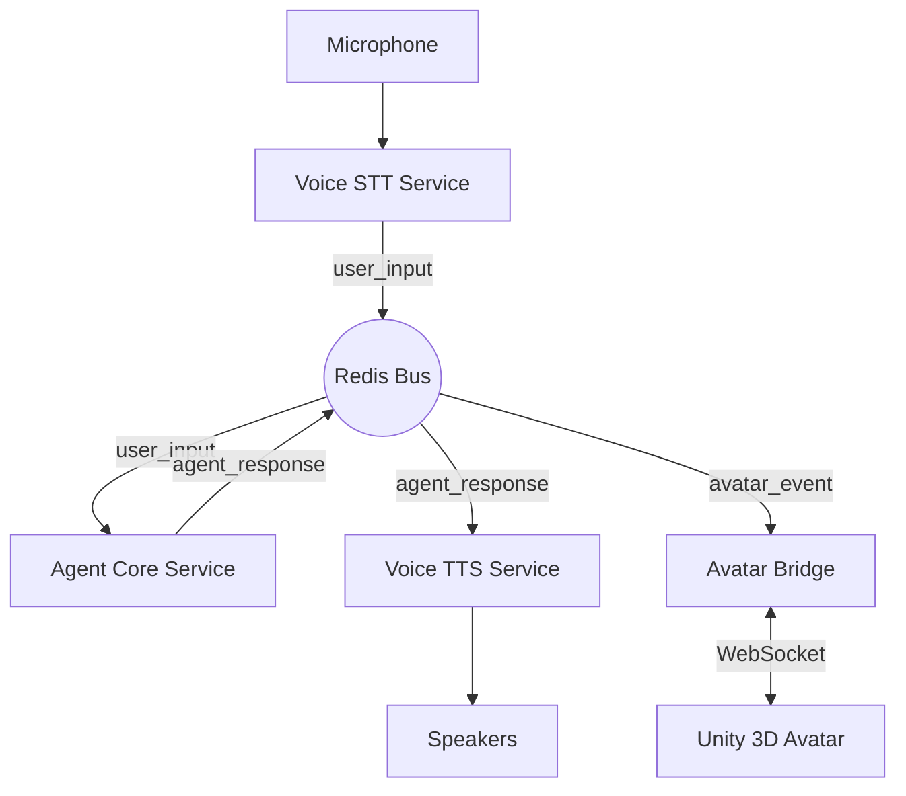

# System Architecture

Sylvia follows a microservices architecture centered around an event-driven message bus.

## High-Level Diagram

## Modular Components

### 1. Agent Core (`services/agent_core`)
- **Responsibility**: Central reasoning, planning, and decision making.
- **Components**:
  - `Personality Engine`: Manages persona/style.
  - `Command Processor`: Executes tools and actions.
  - `Planner`: Breaks down complex tasks.

### 2. Capabilities System (`services/capabilities`)
- Decoupled set of tools and skills invoked by the Agent Core.
- Includes Classifier, Code Analysis, Research Assistant, Device Control.

### 3. Voice Services (`services/voice_stt`, `services/voice_tts`)
- **STT**: Converts audio stream to text events. Supports pluggable providers (Whisper, etc.).
- **TTS**: Converts text events to audio. Supports pluggable providers (Coqui, ElevenLabs, etc.).
- **Events**: `user_input` (Text), `agent_response` (Text).

### 4. Avatar Bridge (`services/avatar_bridge`)
- **Responsibility**: Synchronize state with visual avatar.
- **Protocol**: WebSocket.
- **Events**: Lip-sync data, emotion states, gestures.

### 5. Memory Layer (`services/memory_layer`)
- **Responsibility**: Short-term context and long-term vector storage.
- **Implementation**: SQLite / Vector DB.

## IPC (Inter-Process Communication)

All services communicate asynchronously via Redis Pub/Sub using the `libs.ipc.Messenger` class.
- **Channel**: `sylvia:events`
- **Payload**: JSON objects `{ "type": "event_type", "payload": ... }`
