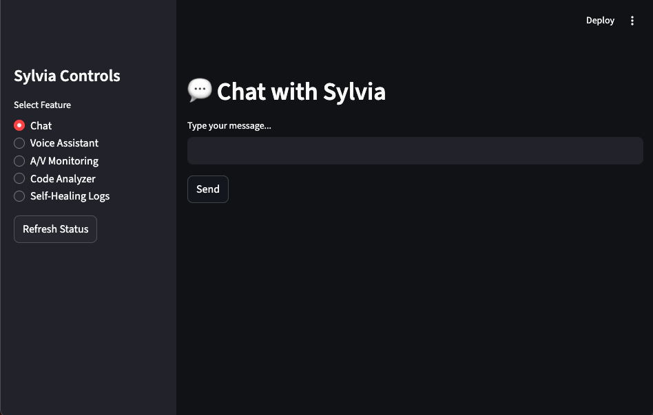
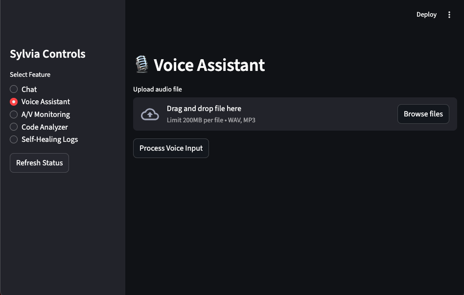
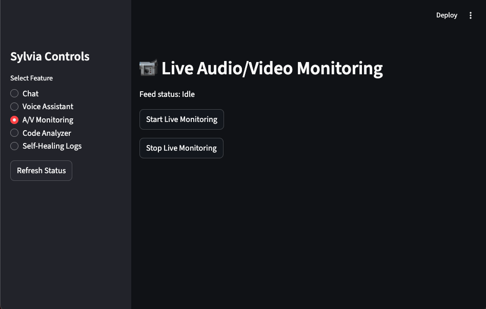
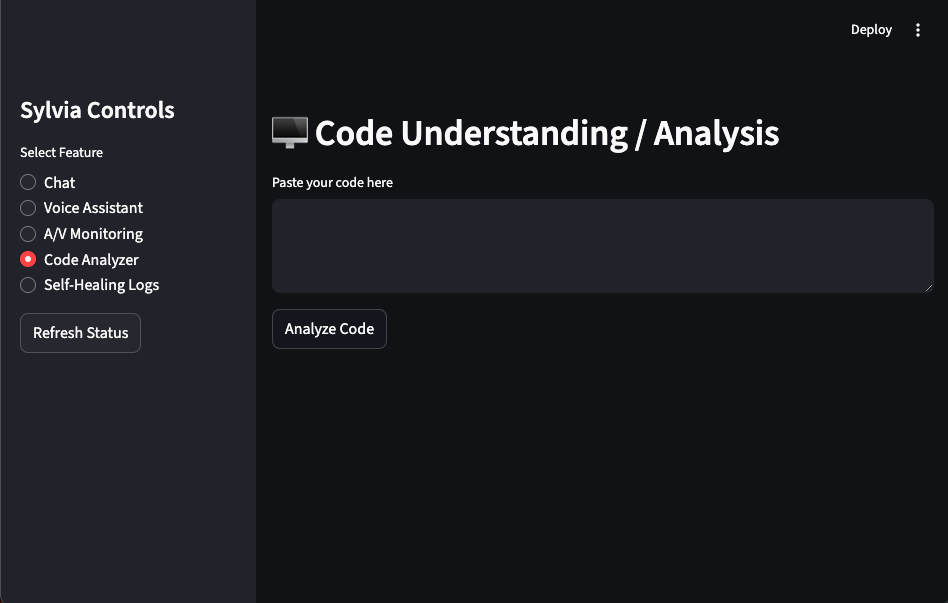
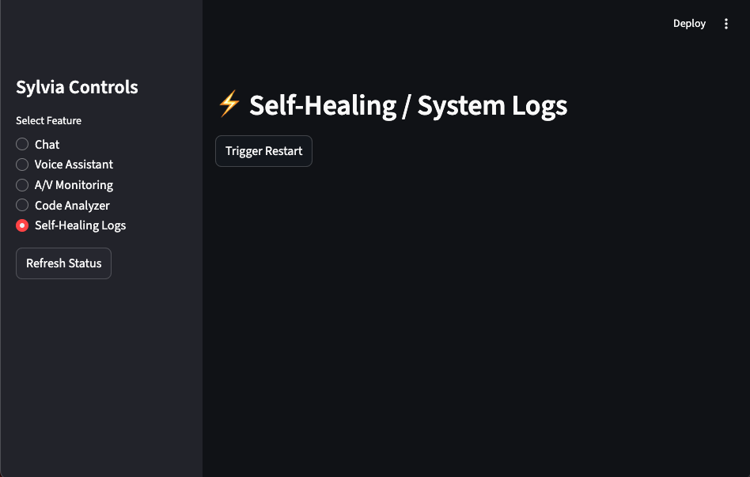

# Sylvia: Multi-Modal, Event-Driven ML Platform

[](https://github.com/asearer/Sylvia/actions/workflows/ci.yml)
[](https://github.com/asearer/Sylvia/actions/workflows/tests.yml)
[](https://codecov.io/gh/asearer/Sylvia)
[](https://www.python.org/downloads/)
[](https://hub.docker.com/r/asearer/sylvia)
[](https://github.com/asearer/Sylvia/blob/main/LICENSE)

---

## Overview

**Sylvia** is a modular, event-driven AI platform designed for **multi-modal interaction, adaptive learning, self-healing, and device control**. Originally a personal ML playground, it has evolved into a **microservice-first architecture**, where every feature — ML apps, vision/audio processing, voice assistant, research assistant, device control, and monitoring — is a self-contained service, orchestrated via **Matrix events**.

---

## 📸 Screenshots

| **Chat Interface** | **Voice Assistant** |
|:---:|:---:|
|  |  |

| **A/V Monitoring** | **Code Analyzer** |
|:---:|:---:|
|  |  |

| **Self-Healing Logs** |
|:---:|
|  |

---

## 1️⃣ Apps vs. Services

- **Apps (`apps/`)**  
  High-level user-facing or orchestrating applications.  
  Example: `sylvia_app` — the main frontend/interaction app.

- **Services (`services/`)**
  Core modular functionality, including:
  - `classifier` — ML model training & inference
  - `personality_engine` — agent behavior and personality
  - `vision` — face & object recognition
  - `sensor_input` — camera & audio activity recognition
  - `voice_assistant` — speech I/O & command processing
  - `code_analysis` — DeepHat-powered code understanding
  - `research_assistant` — document ingestion & querying
  - `device_control` — IoT/network device integration
  - `self_healing` — monitors services and triggers recovery
  - `monitoring` — metrics collection & dashboards
  - `playground` — safe code execution sandbox for Python, JavaScript, and Bash  

Each service is **self-contained**, with its own `src/`, `tests/`, and `Dockerfile`.

---

## 2️⃣ Matrix Event Integration

- Apps and services communicate via **Matrix rooms** (`libs/api-clients/matrix_wrapper.py`).  
- Event types include:  
  `ml.metrics`, `ml.status`, `ml.model`, `vision.detected`, `audio.detected`, `device.command`, `self_healing.alert`, etc.  
- Orchestration example:
  - `sylvia_app` emits a user command event  
  - `voice_assistant` interprets speech, triggers the appropriate service  
  - `classifier` or `research_assistant` responds with results  
  - Monitoring and self-healing services log or recover from failures  

---

## 3️⃣ Project Structure

```
sylvia/
├── apps/
│   └── sylvia_app/
│       ├── src/
│       │   ├── main.py
│       │   └── interface.py
│       ├── tests/
│       │   └── mocks/
│       ├── Dockerfile
│       └── pyproject.toml
├── services/
│   ├── asset_manager/
│   │   ├── src/
│   │   ├── tests/
│   │   └── Dockerfile
│   ├── classifier/
│   │   ├── src/
│   │   ├── tests/
│   │   │   └── fixtures/
│   │   ├── Dockerfile
│   │   ├── requirements.txt
│   │   └── structure.md
│   ├── code_analysis/
│   │   ├── src/
│   │   ├── tests/
│   │   │   └── fixtures/
│   │   └── Dockerfile
│   ├── communication/
│   │   ├── src/
│   │   ├── tests/
│   │   └── Dockerfile
│   ├── data_service/
│   │   ├── src/
│   │   ├── tests/
│   │   └── Dockerfile
│   ├── device_control/
│   │   ├── src/
│   │   ├── tests/
│   │   └── Dockerfile
│   ├── experiment_designer/
│   │   ├── src/
│   │   ├── tests/
│   │   └── Dockerfile
│   ├── monitoring/
│   │   ├── src/
│   │   ├── tests/
│   │   └── Dockerfile
│   ├── multimodal/
│   │   ├── src/
│   │   ├── tests/
│   │   └── Dockerfile
│   ├── personality_engine/
│   │   ├── src/
│   │   │   └── ai_personality/
│   │   │       └── personality/
│   │   ├── data/
│   │   ├── tests/
│   │   ├── Dockerfile
│   │   ├── requirements.txt
│   │   └── structure.md
│   ├── playground/
│   │   ├── src/
│   │   │   ├── executor.py
│   │   │   ├── safety.py
│   │   │   ├── utils.py
│   │   │   ├── main.py
│   │   │   ├── features/
│   │   │   │   └── code_repl.py
│   │   │   ├── languages/
│   │   │   │   ├── python_exec.py
│   │   │   │   ├── javascript_exec.py
│   │   │   │   └── bash_exec.py
│   │   │   └── sandbox/
│   │   │       ├── base_runtime.py
│   │   │       ├── runtime_manager.py
│   │   │       ├── temp_patch.py
│   │   │       ├── languages/
│   │   │       │   ├── python_runtime.py
│   │   │       │   ├── javascript_runtime.py
│   │   │       │   └── bash_runtime.py
│   │   │       └── adapters/
│   │   ├── tests/
│   │   │   ├── test_executor.py
│   │   │   ├── test_safety.py
│   │   │   ├── test_main.py
│   │   │   ├── languages/
│   │   │   └── sandbox/
│   │   ├── Dockerfile
│   │   ├── requirements.txt
│   │   └── structure.md
│   ├── research_assistant/
│   │   ├── src/
│   │   ├── tests/
│   │   └── Dockerfile
│   ├── self_healing/
│   │   ├── src/
│   │   ├── tests/
│   │   └── Dockerfile
│   ├── sensor_input/
│   │   ├── audio/
│   │   │   ├── src/
│   │   │   ├── tests/
│   │   │   ├── Dockerfile
│   │   │   └── requirements.txt
│   │   ├── camera/
│   │   │   ├── src/
│   │   │   ├── tests/
│   │   │   ├── Dockerfile
│   │   │   └── requirements.txt
│   │   ├── Dockerfile
│   │   └── requirements.txt
│   ├── simulation/
│   │   ├── src/
│   │   ├── tests/
│   │   ├── Dockerfile
│   │   └── requirements.txt
│   ├── task_runner/
│   │   ├── src/
│   │   ├── tests/
│   │   └── Dockerfile
│   ├── vision/
│   │   ├── src/
│   │   ├── tests/
│   │   └── Dockerfile
│   └── voice_assistant/
│       ├── src/
│       ├── tests/
│       ├── Dockerfile
│       └── requirements.txt
├── libs/
│   ├── adaptive_learning/
│   ├── api-clients/
│   │   └── messaging/
│   │       └── tests/
│   ├── core/
│   │   ├── agents/
│   │   ├── pipelines/
│   │   ├── tests/
│   │   │   └── core/
│   │   ├── brain.py
│   │   ├── context.py
│   │   └── task_graph.py
│   ├── ml-utils/
│   │   └── preprocessing.py
│   ├── models/
│   └── utils/
├── experiments/
│   └── dashboards/
│       ├── metrics_dashboard.ipynb
│       └── tests/
├── scripts/
│   ├── deploy.sh
│   ├── run_all_apps.sh
│   ├── setup_env.sh
│   └── test_docker_smoke.sh
├── docker-compose.yml
├── requirements.txt
├── README.md
├── .gitignore
└── new-structure.md
```

- `apps/`: orchestrating or user-facing apps  
- `services/`: modular microservices with independent entrypoints  
- `libs/`: shared code (ML utilities, API clients, adaptive learning, logging, helpers)  
- `experiments/`: dashboards, logging, global experiments  
- `scripts/`: DevOps, orchestration, CI/CD helpers  

---

## 4️⃣ Docker & Orchestration

- Each app/service has its **own Dockerfile**.  
- Orchestrate locally via `docker-compose.yml`:
```bash
docker-compose --profile experimental up
````

* Docker example for a service:

```dockerfile
WORKDIR /app
COPY src/ ./src/
CMD ["python", "src/main.py"]
```

* Profiles allow optional or experimental services to be included/excluded.

---

## 5️⃣ Running Tests

* Each app/service has its own `tests/` folder.
* Tests cover ML workflows, event communication, sensor processing, self-healing, and Docker health checks.
* Example commands:

```bash
pytest apps/sylvia_app/tests/
pytest services/classifier/tests/
pytest services/vision/tests/
pytest libs/api-clients/tests/
```

* `conftest.py` fixtures mock Matrix events, sensors, or external dependencies for CI isolation.

---

## 6️⃣ Extending the Platform

* **Add a new service**:

  1. Create `services/<new_service>/src/` with `main.py` and modules
  2. Add `tests/` and `Dockerfile`
  3. Register any new Matrix event types

* **Add a new app** (user-facing orchestrator):

  1. Create `apps/<new_app>/src/` with `main.py`
  2. Add `tests/`, `data/`, `models/`, `Dockerfile`
  3. Integrate services via Matrix events

* **Shared libraries** go in `libs/` and are imported by apps/services.

* Use `docker-compose.yml` for local orchestration, scaling, or testing.

---

## 7️⃣ Playground Service

The **Playground Service** provides safe, sandboxed code execution for Python, JavaScript, and Bash with security filtering and timeout enforcement.

### Features:
- **Multi-language support**: Python, JavaScript (via py-mini-racer), and Bash
- **Safety filtering**: Blocks dangerous operations (file I/O, network, system commands)
- **Timeout enforcement**: Configurable execution timeouts (default 5s)
- **Isolated execution**: Sandboxed runtimes with restricted builtins
- **RESTful API**: FastAPI-based service on port 5002

### API Endpoints:
```bash
# Execute code
POST /execute
{
  "code": "print(2 + 2)",
  "language": "python",
  "timeout": 5
}

# Health check
GET /health
```

### Docker Usage:
```bash
cd services/playground
docker build -t sylvia-playground .
docker run -p 5002:5002 sylvia-playground
```

### Safety Features:
- Blocks: `import os`, `import sys`, `subprocess`, file operations, network calls
- Restricted builtins in Python sandbox
- Configurable timeout per execution
- Returns structured results with stdout, stderr, and exit codes

---

## 8️⃣ Event & Service Map (Simplified)

| Service            | Handles Event Types             | Consumed By                    |
| ------------------ | ------------------------------- | ------------------------------ |
| sylvia_app         | user.command                    | All services                   |
| classifier         | ml.train, ml.predict            | sylvia_app, monitoring         |
| personality_engine | personality.update              | sylvia_app, voice_assistant    |
| vision             | vision.detected                 | sylvia_app, monitoring         |
| sensor_input       | audio.detected, camera.detected | sylvia_app, monitoring         |
| voice_assistant    | speech.input, command           | sylvia_app, device_control     |
| code_analysis      | code.analyze                    | sylvia_app, research_assistant |
| research_assistant | query.process                   | sylvia_app, monitoring         |
| device_control     | device.command                  | sylvia_app, voice_assistant    |
| self_healing       | self_healing.alert              | monitoring, sylvia_app         |
| monitoring         | metrics.update, system.health   | sylvia_app                     |
| playground         | code.execute                    | sylvia_app, research_assistant |

---

*Sylvia is now a modular, scalable, multi-modal AI platform: fully testable, event-driven, adaptive, and production-ready.*

